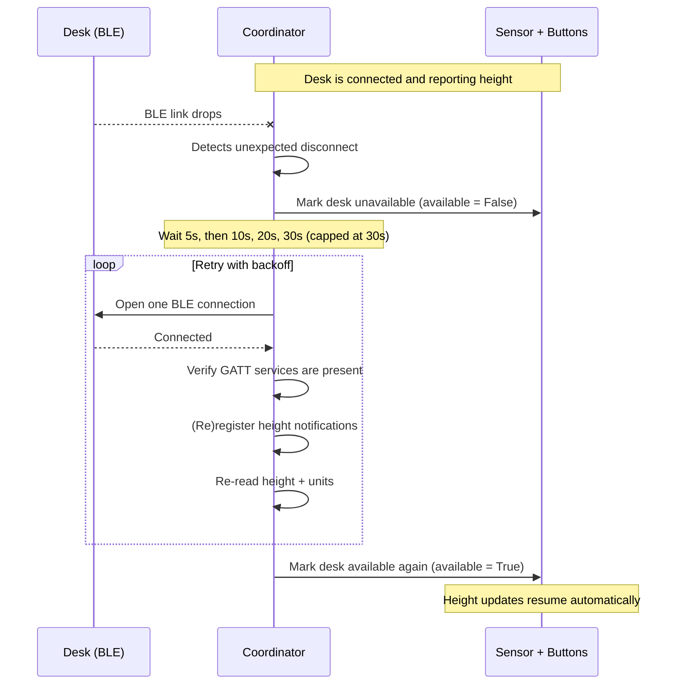

# Disconnect & Reconnect Behavior

This page explains, in plain language, what happens to your Uplift Desk when the
Bluetooth (BLE) link between Home Assistant and the desk drops, and how the
integration recovers **automatically** — with no user action and no Home
Assistant restart required.

## Why a BLE link can drop

A BLE link to the desk is not a permanent, always-on connection. It can be lost
for ordinary reasons:

- The Bluetooth adapter or the desk briefly goes to sleep and wakes up.
- The desk moves out of range (or behind an obstruction) for a moment.
- A nearby device or the Uplift app grabs the connection.
- The host's Bluetooth stack (BlueZ) resets the adapter.

Before this work, a dropped link left the integration "dead but connected": the
desk appeared connected, but no height updates ever arrived again, and the desk
was unusable until you restarted Home Assistant or reloaded the integration.
That is no longer the case.

## What happens when the link drops

The integration now **detects** the drop, marks the desk as **unavailable**,
and then **reconnects on its own** using a short, bounded wait between attempts.

### Timeline: drop → recovery

Step by step:

1. **The link drops and the coordinator notices.**
   Home Assistant's Bluetooth layer tells the coordinator that the connection
   ended unexpectedly. The coordinator logs
   `Desk connection lost; will attempt to reconnect` (a warning) and begins
   recovery. This only happens for *unexpected* drops — a deliberate
   disconnect (for example, unloading the integration) is handled cleanly and
   does **not** trigger a reconnect.

2. **The desk immediately shows as unavailable.**
   The height sensor and all preset buttons flip to *unavailable* the moment
   the link is gone. You will see the sensor value disappear (rather than a
   stale, frozen number), which is the honest state: the desk is down.

3. **Automatic reconnection begins, with a bounded wait between tries.**
   The integration retries the full connect cycle on a backoff schedule:
   **5 s → 10 s → 20 s → 30 s**, capping at 30 seconds between attempts. It
   keeps trying on this schedule until it succeeds, you intentionally stop the
   integration, or Home Assistant is stopped.

4. **On a successful reconnect, everything resumes — by itself.**
   Once the connection is re-established, the integration:
   - re-registers the GATT notifications so live height updates flow again,
   - re-reads the current height and units so the sensor has a fresh value,
   - and marks the sensor and preset buttons **available** again.

   No button press, no reload, and no Home Assistant restart is needed.

## Defending against a "connected but broken" GATT state

There is a known race in the Linux Bluetooth stack (BlueZ) and the `bleak`
library it uses. In that race, the integration can *connect* to the desk
successfully, but the desk's GATT service set comes back **empty or partial**.
A connected-but-broken client like this used to fail much later, deep inside a
command, with a confusing error.

The integration now handles this proactively:

1. **Detected early.** Before the connection is put to work, the integration
   checks that the connected client actually exposes the desk's required GATT
   services and characteristics. An empty or partial set is caught right away —
   not deep inside a later command.
2. **The stale stack cache is cleared.** The Bluetooth stack caches a device's
   service list, and in this race that cache can hold an empty entry. The
   integration clears that cache so the next attempt performs a fresh
   discovery.
3. **It reconnects once, then gives up gracefully.** After clearing the cache,
   the integration makes **one** retry. If the second attempt is also empty or
   partial, it stops trying for that cycle rather than spinning forever.

If the desk still cannot be reached after that, the integration degrades to a
clean **"unavailable / retrying"** state instead of a dead-but-connected one:

- **At runtime** (the desk was working, then dropped), the height sensor and
  buttons stay *unavailable* while the background reconnect loop keeps trying
  on the backoff schedule. The moment the desk is reachable again, it recovers
  on its own.
- **At startup** (the desk is unreachable when Home Assistant starts or the
  integration is (re)loaded), the config entry shows a **"retrying"** state
  instead of a hard, permanent failure. Home Assistant keeps retrying setup on
  its own schedule, and the entry becomes active as soon as the desk is
  reachable.

## One connection per (re)connect cycle

Each (re)connect cycle opens **exactly one** BLE connection to do the real
work. The old code opened extra "validation" connections and disconnected again
just to check the device, which churned the shared Bluetooth manager and made
the race above more likely. That churn is gone: the single connection that is
opened is the one that is validated and then used. (The only time a second
connection is opened is the recovery path above — after the cache is cleared,
the integration reconnects once to try again.)

## What you should see in normal operation

- A brief *unavailable* blip on the sensor and buttons when the link drops.
- A warning in the logs: `Desk connection lost; will attempt to reconnect`.
- A short pause (5–30 seconds), then the desk becomes available again.
- An info log when recovery succeeds: `Reconnected to desk …`.
- Live height updates resume.

See the [Troubleshooting](troubleshooting.md) page for how to read the logs in
detail and what to do if the desk does not come back.
